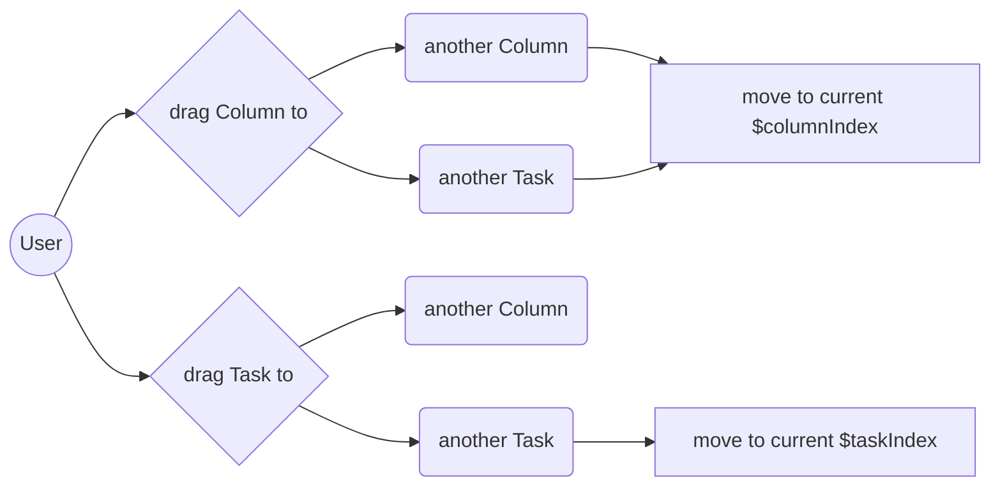

# you can fake anything

## [grr](https://github.com/zhangjinglearning/grr) copy from Trello.

It's not George's dinosaur. You know, I am not a child, I am an adult. I can't simply name it with my favorite cartoon. That looks like too naive! According to that, I use the grr that my favorite cartoon character often said words.

I love jumping up and down in muddy puddles!

It's me grow with simple things every day. And you can organize everything with grr the same.

### requirement

- Meteor
- Vue
- Vuetify

### Flowchart

## scenario copy from Clear Todos

scenario means you can't be done clear ever, but you must use it every day.
